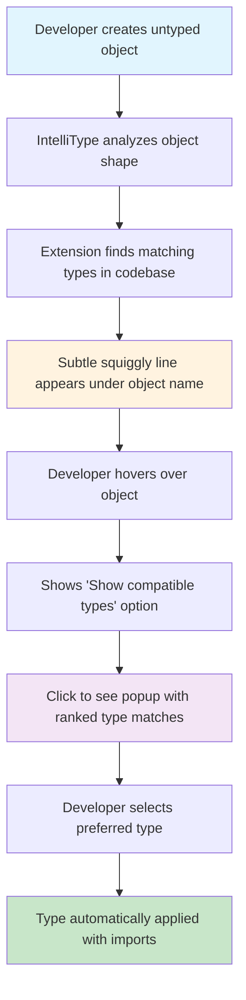
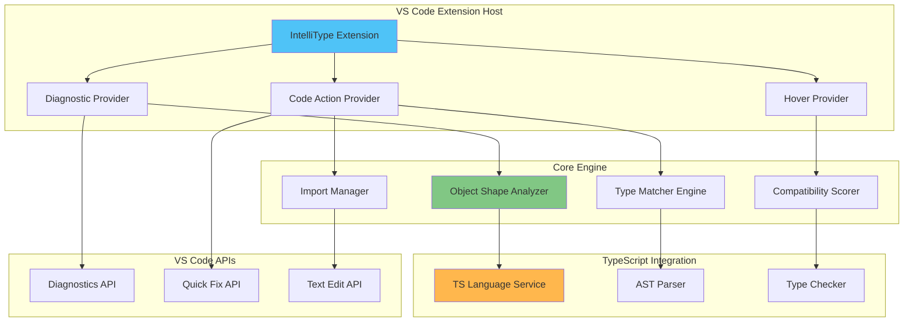
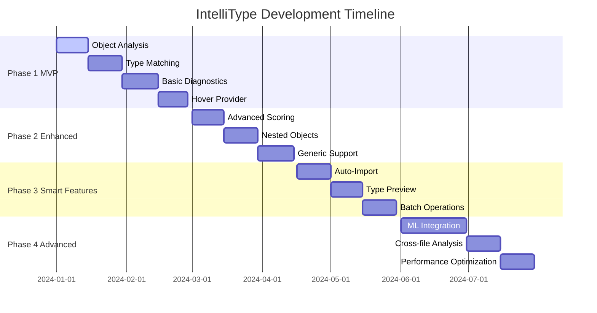
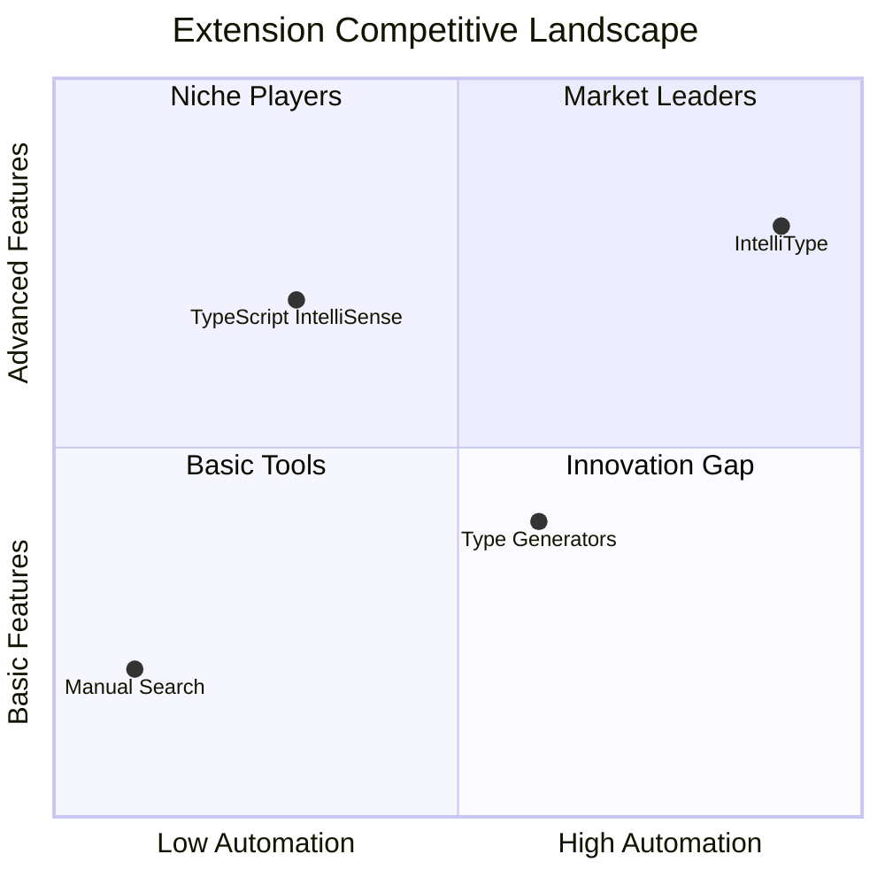

# IntelliType - VS Code Extension Concept

## 🎯 Overview

**IntelliType** is a VS Code extension designed to solve one of TypeScript developers' most common pain points: finding and applying the right types and interfaces for untyped objects in large codebases.

## 🚀 Core Problem

When working with TypeScript in large projects, developers often:
- Create objects without knowing that matching types already exist
- Spend significant time searching through files to find the right interface
- Miss opportunities to reuse existing types, leading to code duplication
- Struggle to maintain type consistency across the codebase

## 💡 Solution

IntelliType provides intelligent type suggestions by analyzing untyped objects and matching them against existing types and interfaces in the codebase.

## 🎨 User Experience Flow



## 🔧 Core Features

### 1. Smart Object Analysis
- Continuously scans TypeScript files for untyped variables and objects
- Analyzes object shapes and property structures
- Identifies candidates that could benefit from explicit typing

### 2. Visual Type Indicators
- Shows subtle squiggly underlines beneath untyped objects that have potential matches
- Non-intrusive visual cues that don't clutter the editor
- Integrates seamlessly with VS Code's existing diagnostic system

### 3. Interactive Type Discovery
- **Hover Interaction**: Hover over underlined objects to see available actions
- **"Show Compatible Types" Option**: Click to view matching types
- **Native VS Code UX**: Follows established VS Code interaction patterns

### 4. Intelligent Type Matching
- **Shape Analysis**: Compares object properties with existing interfaces
- **Compatibility Scoring**: Ranks matches by compatibility percentage
- **Property Matching**: Considers property names, types, and optionality
- **Inheritance Awareness**: Understands type hierarchies and extensions

### 5. One-Click Type Application
- **Instant Application**: Click a suggested type to apply it immediately
- **Auto-Import**: Automatically adds necessary import statements
- **Smart Positioning**: Places imports in the appropriate location
- **Undo Support**: Full undo/redo integration

## 📋 Technical Architecture



### Core Components

#### 1. TypeScript Language Server Integration
- Leverages VS Code's TypeScript language service
- Accesses type information and AST parsing
- Integrates with existing TypeScript tooling

#### 2. Object Shape Analyzer
```typescript
interface ObjectShape {
  properties: PropertySignature[];
  methods: MethodSignature[];
  compatibility: number;
}
```

#### 3. Type Matcher Engine
- Fuzzy matching algorithm for type compatibility
- Scoring system based on property overlap
- Handles optional properties and type unions

#### 4. Diagnostic Provider
- Implements VS Code's diagnostic API
- Provides squiggly underlines for type suggestions
- Integrates with existing TypeScript diagnostics

#### 5. Code Action Provider
- Implements quick fix suggestions
- Handles type application and import insertion
- Provides preview of changes before applying

### Key APIs Used
- `vscode.languages.registerCodeActionsProvider`
- `vscode.languages.createDiagnosticCollection`
- TypeScript Compiler API for type analysis
- VS Code's `TextEdit` API for code modifications

## 🎯 Target Users

### Primary Users
- **TypeScript Developers** working in medium to large codebases
- **Frontend Developers** using React, Angular, Vue with TypeScript
- **Backend Developers** using Node.js with TypeScript
- **Full-stack Developers** managing multiple TypeScript projects

### Use Cases
- **Legacy Code Migration**: Adding types to existing JavaScript code
- **Large Team Projects**: Maintaining type consistency across teams
- **API Integration**: Matching response objects to existing interfaces
- **Code Refactoring**: Discovering reusable types during refactoring

## 📊 Success Metrics

### Developer Productivity
- **Time Saved**: Reduce type discovery time from minutes to seconds
- **Code Quality**: Increase type reuse and consistency
- **Developer Experience**: Reduce cognitive load in type management

### Measurable Outcomes
- Reduction in duplicate type definitions
- Increased adoption of existing interfaces
- Faster onboarding for new team members
- Improved TypeScript compilation times

## 🚧 Development Roadmap



### Phase 1: MVP (Minimum Viable Product)
- [ ] Basic object shape analysis
- [ ] Simple type matching algorithm
- [ ] Diagnostic provider for squiggly lines
- [ ] Basic hover provider with "Show compatible types"
- [ ] Simple type application without imports

### Phase 2: Enhanced Matching
- [ ] Advanced compatibility scoring
- [ ] Support for nested objects and arrays
- [ ] Generic type handling
- [ ] Union and intersection type support

### Phase 3: Smart Features
- [ ] Auto-import functionality
- [ ] Type preview before application
- [ ] Batch type application for multiple objects
- [ ] Configuration options and preferences

### Phase 4: Advanced Intelligence
- [ ] Machine learning for better type suggestions
- [ ] Cross-file type analysis
- [ ] Integration with popular TypeScript frameworks
- [ ] Performance optimizations for large codebases

## ⚙️ Configuration Options

```json
{
  "intellitype.enabled": true,
  "intellitype.showDiagnostics": true,
  "intellitype.minimumCompatibilityScore": 0.7,
  "intellitype.maxSuggestions": 10,
  "intellitype.includeNodeModules": false,
  "intellitype.autoImport": true,
  "intellitype.showPreview": true
}
```

## 🔍 Example Scenarios

### Scenario 1: API Response Object
```typescript
// Before
const user = {
  id: 1,
  name: "John Doe",
  email: "john@example.com",
  createdAt: new Date()
};

// IntelliType suggests: User, UserProfile, ApiUser interfaces
// After one click:
const user: User = {
  id: 1,
  name: "John Doe", 
  email: "john@example.com",
  createdAt: new Date()
};
```

### Scenario 2: Component Props
```typescript
// Before
const buttonProps = {
  text: "Click me",
  variant: "primary",
  onClick: () => console.log("clicked")
};

// IntelliType suggests: ButtonProps, ComponentProps
// Auto-imports the interface
```

## 🏆 Competitive Analysis



### Unique Value Propositions
1. **Proactive Type Discovery**: Finds types you didn't know existed
2. **Zero Configuration**: Works out of the box with any TypeScript project
3. **Native Integration**: Feels like a built-in VS Code feature
4. **Smart Matching**: Advanced algorithms for accurate type suggestions
5. **Productivity Focus**: Optimized for developer workflow efficiency

### Differentiation from Existing Tools
- **vs TypeScript IntelliSense**: Proactive suggestions vs reactive completion
- **vs Manual Search**: Automated discovery vs manual hunting
- **vs Type Generators**: Uses existing types vs creating new ones

## 📈 Market Opportunity

### Market Size
- **VS Code Users**: 15+ million active developers
- **TypeScript Adoption**: Growing rapidly, used by 60% of developers
- **Enterprise Usage**: High adoption in medium to large companies

### Monetization Potential
- **Freemium Model**: Basic features free, advanced features paid
- **Enterprise Licensing**: Team features and advanced analytics
- **Marketplace Success**: High-quality extensions see significant downloads

## 🎉 Conclusion

IntelliType addresses a real, daily pain point for TypeScript developers by making type discovery and application effortless. With its intuitive UX and powerful matching algorithms, it has the potential to become an essential tool in every TypeScript developer's toolkit.

The extension combines technical innovation with practical utility, offering immediate value while laying the groundwork for advanced AI-powered development assistance features.

---

**Next Steps**: 
1. Set up VS Code extension development environment
2. Implement MVP with basic type matching
3. Gather feedback from TypeScript developer community
4. Iterate and enhance based on real-world usage
